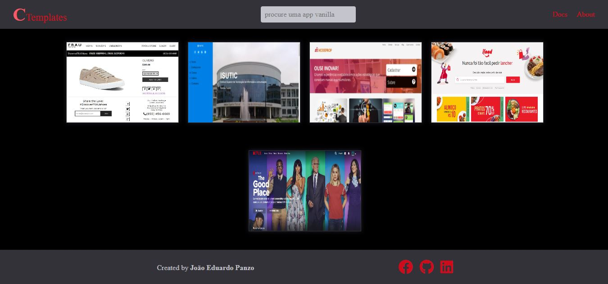

# Conjunto de Templetes no único repositório

<h1 align="center">
    
</h1>

## 🧪 Tecnologias

Esse projeto foi desenvolvido com as seguintes tecnologias:

- [HTML](https://developer.mozilla.org/pt-BR/docs/Web/HTML)
- [CSS](https://developer.mozilla.org/pt-BR/docs/Web/CSS)
- [JavaScrpt](https://developer.mozilla.org/pt-BR/docs/Web/JavaScript)

## 🚀 Como executar

Clone o projeto e acesse a pasta do mesmo.

```bash
$ git clone https://github.com/EduardoPanzo/templates-cloned-without-framework
$ cd templates-cloned-without-framework
```

Para iniciá-lo, siga os passos abaixo:
```bash
# Iniciar o projeto
$ abrir na raiz o arquivo #index.html 
```
O app estará disponível no seu browser


## 💻 Projeto

* Nesta app , teremos a junção de muitos dos landing pages feitas por mim ou por meio de um curso...

* Pagina inicial: composto por um header e um footer e uma área pricipal, onde poderás escolher que lading page que ver...
* pagina selecionada: após a seleção de uma página é possivel navegar por ela e vê o que ela tem.. tando de visual como funcional.


---

Feito por João Eduardo Panzo